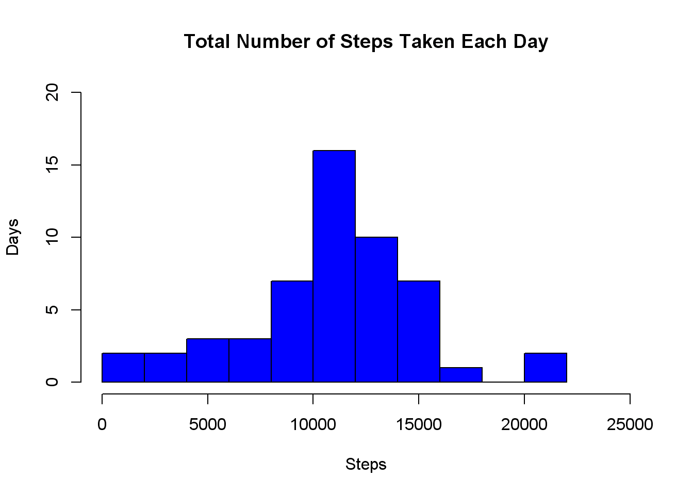
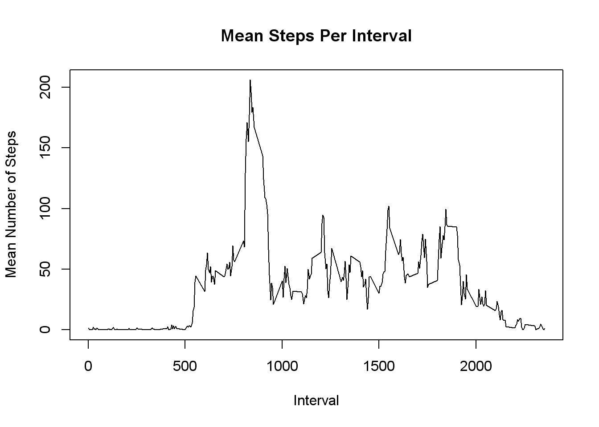
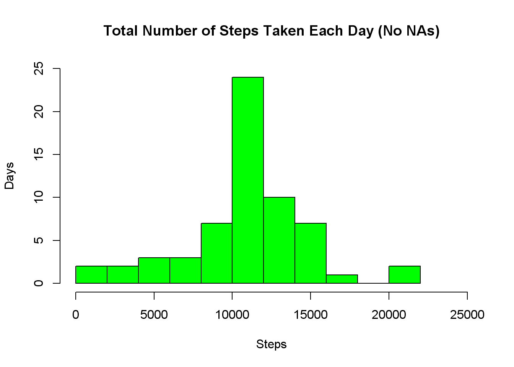
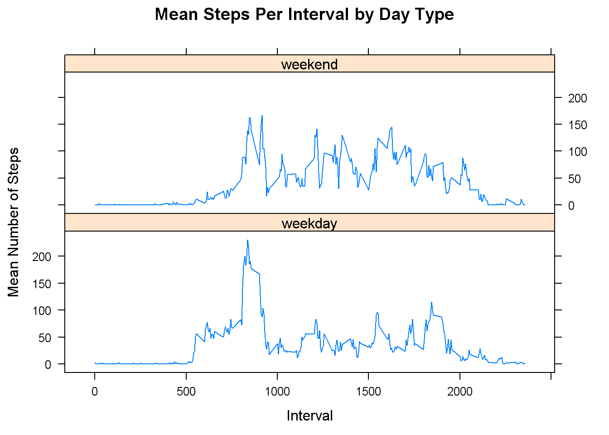

<style type="text/css">
.code {font-family: Consolas, Monaco, Courier New;}
li {font-weight: bold;}
</style>

# Reproducible Research: Peer Assessment 1

## Loading and Preprocessing the Data
  
<br />
### Acquiring the Data
The GitHub repository that was cloned for this assignment included the data 
file, so it was not necessary to download it separately. However, for
completeness I chose to include code to download the zipped archive and extract
the data file.  
  
We first check to see if we have a subdirectory named "data" and create it if
we don't.


```r
if (!file.exists("data")) {
        dir.create("data")
}
```

Then if the data subdirectory doesn't contain the zip file, we download the zip
file to the data directory and extract the data file.


```r
if (!file.exists("./data/activity.zip")) {
        
        url <- paste0("https://d396qusza40orc.cloudfront.net/",
                      "repdata%2Fdata%2Factivity.zip")
        
        download.file(url,
                      "./data/activity.zip", 
                      "curl", 
                      T)
        
        unzip("./data/activity.zip", exdir="./data")
}
```
  
<br />
### Loading the Data
We load the data into a variable called <span class="code">activity</span> 
using <span class="code">read.csv()</span>.


```r
activity <- read.csv("./data/activity.csv", 
                     header=TRUE, 
                     sep=",")
```
  
<br /><br />
## What is mean total number of steps taken per day?
Using the <span class="code">aggregate()</span> function, we apply the 
<span class="code">sum()</span> function to total the steps
by date. This gives us the total number of steps taken per day.


```r
stepsPerDay <- aggregate(steps ~ date, data=activity, sum)

histActivity <- hist(stepsPerDay$steps, 
                     breaks=10, 
                     col="blue", 
                     main="Total Number of Steps Taken Each Day", 
                     xlab="Steps", 
                     ylab="Days", 
                     xlim=range(0:25000), 
                     ylim=range(0:20))
```

 

The mean and median steps per day are calculated simply by passing the 
<span class="code">steps</span> attribute to the <span class="code">mean()</span>
and <span class="code">median()</span> functions respectively.


```r
dailyMean <- mean(stepsPerDay$steps)
dailyMedian <- median(stepsPerDay$steps)
```

<ul>
<li>
The mean steps per day is 10,766.
</li>
<li>
The median steps per day is 
10,765.
</li>
</ul>  

<br />

## What is the average daily activity pattern?
To calculate the mean number of steps per 5-minute interval, we again use the
<span class="code">aggregate()</span> function and store the result in a variable
called <span class="code">stepsMeanPerInterval</span>. We then use the result to
create a time series plot.


```r
stepsMeanPerInterval <- aggregate(steps ~ interval, data=activity, mean)

plot(stepsMeanPerInterval, type="l")
```

 

To determine which interval has the maximum number of steps, we extract the row
from <span class="code">stepsMeanPerInterval</span> that has the maximum steps 
value, then we look at the interval of that row.


```r
infoMax <- stepsMeanPerInterval[which.max(stepsMeanPerInterval$steps), ]
maxInterval <- infoMax$interval
maxSteps <- infoMax$steps
```

<ul>
<li>
Interval 835 contains the maximum number of steps (206.1698).
</li>
</ul>
  
<br />

## Imputing missing values

On visually inspecting the data, it looks like the only attribute missing data
is <span class="code">steps</span>. We confirm this by checking each column for 
<strong>NA</strong> values.

```r
apply(activity, 2, function(x) any(is.na(x)))
```

```
##    steps     date interval 
##     TRUE    FALSE    FALSE
```

Now that we are certain the only column that contains <strong>NA</strong> values
is the first column (<span class="code">steps</span>), we count how many 
<strong>NA</strong>s there are in that column.


```r
NAcount <- sum(is.na(activity[, 1]))
```

<ul>
<li>
The total number of rows containing NAs is 2,304.
</li>
</ul>  

<br />

We want to fill in the missing values, but we also want to preserve the original
dataset. We make a copy of the data.


```r
activityNoNA <- activity
```
  
<br />

### Strategy

To fill in the missing values, we loop over the duplicate dataset. For each
row, if <span class="code">steps</span> contains <strong>NA</strong>, we 
retrieve the interval from that same row. Then from the 
<span class="code">stepsMeanPerInterval</span> we 
created earlier we extract the steps from the row that has the corresponding 
interval. Lastly, we replace the <strong>NA</strong> in the duplicate dataset 
with the mean value retrieved from 
<span class="code">stepsMeanPerInterval</span>.


```r
# loop over duplicate dataset and replace NAs with
# mean for the corresponding interval
for (i in 1:nrow(activityNoNA)) {
        
        # if current row is missing value
        if (is.na(activityNoNA[i, 1])) {
                
                # get interval
                currInterval <- activityNoNA[i, 3]
                
                # retrieve the mean for the interval
                currMean <- stepsMeanPerInterval[
                        which(stepsMeanPerInterval[, 1] == currInterval), 
                        2]
                
                # replace NA with mean
                activityNoNA[i, 1] <- currMean
        } # end if
} # end for
```

As we did previously, we use <span class="code">aggregate()</span> to calculate 
the total steps per day for the new dataset.


```r
stepsPerDayNoNA <- aggregate(steps ~ date, data=activityNoNA, sum)

histActivityNoNA <- hist(stepsPerDayNoNA$steps, 
                         breaks=10, 
                         col="green", 
                         main="Total Number of Steps Taken Each Day (No NAs)", 
                         xlab="Steps", 
                         ylab="Days", 
                         xlim=range(0:25000), 
                         ylim=range(0:25))
```

 

The mean and median steps per day are calculated similarly as before.


```r
dailyMeanNoNA <- mean(stepsPerDayNoNA$steps)
dailyMedianNoNA <- median(stepsPerDayNoNA$steps)
```

<ul>
<li>
The mean steps per day is
10,766.
</li>
<li>
The median steps per day is 
10,766.  
</li>
</ul>  

<br />

### Impact of Imputing Missing Data
The means for each dataset are identical, and the medians are different only by
1. So there is a little to no impact in these statictics.  

The two histograms for the datasets look very similar, but there appears to be
a difference in the 10,000 to 12,000 bin. An examination of the two histogram
objects reveals the value for this bin in the original dataset is 16 while the
value for the dataset with imputed values is 24 (a 50% increase). All other bins
are identical.


```r
histActivity$breaks
```

```
##  [1]     0  2000  4000  6000  8000 10000 12000 14000 16000 18000 20000
## [12] 22000
```

```r
histActivityNoNA$breaks
```

```
##  [1]     0  2000  4000  6000  8000 10000 12000 14000 16000 18000 20000
## [12] 22000
```

```r
histActivity$counts
```

```
##  [1]  2  2  3  3  7 16 10  7  1  0  2
```

```r
histActivityNoNA$counts
```

```
##  [1]  2  2  3  3  7 24 10  7  1  0  2
```
  
<br />

## Are there differences in activity patterns between weekdays and weekends?
To examine the activity patterns for weekdays and weekends, it will be helpful
to have a new factor to designate which dates are week days and which are
weekend days.  
  
First we create a function to determine the type of day (weekday or weekend)
for a specific date. The function takes a date as an argument and checks the
name of the day of the week. If the day name is "Saturday" or "Sunday",
"weekend" is returned. Otherwise, "weekday" is returned.


```r
DayType <- function(x) {
        
        switch(weekdays(x),
               "Saturday" = ,
               "Sunday" = "weekend",
               "weekday")
}
```

To create the factor, we start by creating an empty vector. Then we loop over the 
duplicate dataset and determine if each date is a weekday or weekend. As each
day type is determined, it is added to the vector. When complete, the vector is
added to the dataset as a factor.


```r
dayType <- c()

for (i in 1:nrow(activityNoNA)) {
        
        dayType <- c(dayType, DayType(as.Date(activityNoNA[i, 2], "%Y-%m-%d")))
}

activityNoNA$dayType <- factor(dayType)
```

To construct the panel plot of the average number of steps taken, averaged across
all weekday days or weekend days, we calculate the means. Then, we assign values
we want to plot to variables to make the code more human readable and build the
plot using <span class="code">xyplot()</span> from the
<span class="code">lattice package</span>.


```r
stepsMeanPerIntervalPerDayType <- aggregate(steps ~ interval + dayType, 
                                            data=activityNoNA, mean)

steps <- stepsMeanPerIntervalPerDayType$steps
interval <- stepsMeanPerIntervalPerDayType$interval
dayType <- stepsMeanPerIntervalPerDayType$dayType

library(lattice)
xyplot(steps ~ interval | dayType, 
       layout=c(1, 2), 
       type="l",
       xlab="Interval",
       ylab="Number of Steps")
```

 

